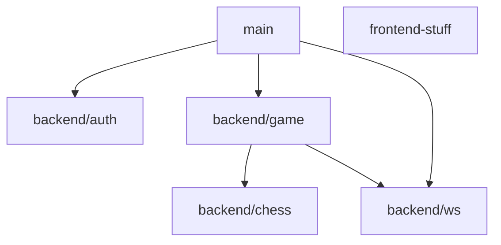

# Chess Server

## Package Dependency Flow



## Packages
    - Main: Handles setting multiple services up
    - Auth: Authentication related logic
    - WS: Websocket related logic
    - Game: Backend service logics in general, stateful.
    - Chess: Pure chess logic, move validation.

### Matches
Chess matches are not executed as long-running processes. Instead, all relevant state is stored and retrieved on demand, and game logic is applied only when actions occur.

### Websocket & Handlers
Each WebSocket connection is associated with a handler responsible for processing incoming messages. When a message is received, it is forwarded to the assigned handler, which determines how to handle it. Currently, there are LobbyHandler and MatchHandler.

### Auth
Clients hit `/join` to receive a JWT cookie, and every WebSocket request validates that token to bind messages to a player identity. This keeps sessions lightweight and avoids server-side state for auth.

### Chess Engine
The `backend/chess` package implements per-piece move rules, board validation, and special-move support (castling, en passant) using move history to keep the game state consistent and authoritative. The special-move support is not my most proud design, but the way it works is it gives a second slot that can be filled during piece validation and then applied. Example: if the server gets a ws message telling white moved king to l/r by 2, validation accepts that as castle (with more checks), and moves the rook too.

## Run

```bash
go mod download
go run main.go
```

Open http://localhost:8888 in a browser.

Note: If you want to test multiple players locally, use an incognito window (or another browser) so each player gets a separate token cookie, or you will regret it, as I did ://

## API

### GET /join
Assigns a username (or generates one) and sets a JWT cookie.

Example request:
```bash
curl -i "http://localhost:8888/join?username=Mech"
```

Example response:
```http
HTTP/1.1 200 OK
Set-Cookie: token=eyJhbGciOiJIUzI1NiIs...; Path=/; HttpOnly
```

## WebSocket
All WS messages use an envelope with `type` and `data`:

```json
{
    "type":"SOME_TYPE",
    "data":{}
}
```

### WS /ws/lobby

Client -> Server

MATCH_INVITE:
```json
{
    "type":"MATCH_INVITE",
    "data":{
        "to":"OpponentName"
    }
}
```

MATCH_ACCEPT:
```json
{
    "type":"MATCH_ACCEPT",
    "data":{
        "from":"OpponentName",
        "to":"YourName"
    }
}
```

Server -> Client

PLAYER_LIST:
```json
{
    "type":"PLAYER_LIST",
    "data":{
        "players":["Alice","Bob"]
    }
}
```

MATCH_INVITE:
```json
{
    "type":"MATCH_INVITE",
    "data":{
        "from":"Alice",
        "to":"Bob"
    }
}
```

MATCH_START:
```json
{
    "type":"MATCH_START",
    "data":{
        "opponent":"Alice",
        "first_move":"Bob",
        "match_id":"42"
    }
}
```

### WS /ws/match/{id}

Client -> Server

MOVE:
```json
{
    "type":"MOVE",
    "data":{
        "pos_from":[4,1],
        "pos_to":[4,3]
    }
}
```

Server -> Client

MOVE_MADE:
```json
{
    "type":"MOVE_MADE",
    "data":{
        "last_move":{
            "pos_from":[4,1],
            "pos_to":[4,3],
            "SpecialMoveEffect":{
                "PosFrom":{"X":4,"Y":6},
                "PosTo":{"X":4,"Y":6},
                "SpecialMoveType":"promotion",
                "PieceType":"Queen"
            }
        },
        "turn_now":"OpponentName"
    }
}
```

ERROR:
```json
{
    "type":"ERROR",
    "data":"Illegal Move"
}
```
# Frontend
<p align="center">
    
</p>

<p align="center">
    
</p>

<p align="center">
    
</p>
